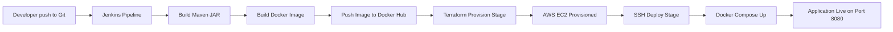
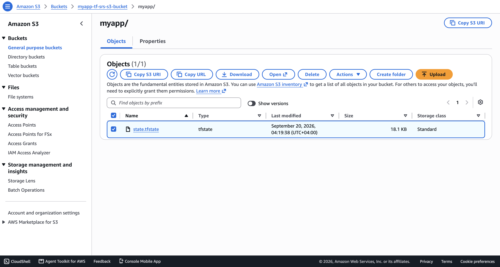

# Jenkins Complete CI/CD with Terraform Shared Remote State

Terraform is an infrastructure as code tool that lets you build, change, and version cloud and on-prem resources safely and efficiently using human-readable configuration files.

Jenkins is a self-contained, open source automation server which can be used to automate all sorts of tasks related to building, testing, and delivering or deploying software.

## Overview

This project demonstrates a complete CI/CD pipeline where infrastructure provisioning is integrated directly into the delivery workflow. Instead of deploying to a pre-existing server, Jenkins provisions a new AWS EC2 instance with Terraform, then deploys the latest Dockerized Java application automatically.

The implementation combines CI and CD in one pipeline:

- CI: Build Java Maven artifact.
- CI: Build and push Docker image to Docker Hub.
- CD: Provision EC2 infrastructure with Terraform.
- CD: Deploy the new image version on the freshly provisioned server using Docker Compose.

### Terraform key features

- Declarative infrastructure: define desired state instead of imperative steps.
- Plan and apply workflow: inspect intended changes before execution.
- State tracking: Terraform tracks managed resources in state files.
- Idempotency: repeated runs converge to desired state without duplicating resources.
- Provider ecosystem: integrates with AWS and many other platforms.
- Automation-friendly: easily integrated into CI/CD pipelines such as Jenkins.
- Remote state backends: state can be stored remotely (for example in AWS S3) so it is shared safely across team members and CI/CD jobs instead of living only on a laptop or in Git.

## Demo Project

Jenkins Complete CI/CD with Terraform

## Technologies used

- Terraform
- Jenkins
- Docker
- AWS
- Git
- Java
- Maven
- Linux
- Docker Hub

## Project Description

- Integrate provisioning stage into complete CI/CD Pipeline to automate provisioning server instead of deploying to an existing server
- Create SSH Key PairInstall Terraform inside Jenkins container
- Add Terraform configuration to application's git repository
- Adjust Jenkinsfile to add "provision" step to the CI/CD pipeline that provisions EC2 instance
- So the complete CI/CD project we build has the following configuration:
  - a. CI step: Build artifact for Java Maven application
  - b. CI step: Build and push Docker image to Docker Hub
  - c. CD step: Automatically provision EC2 instance using TF
  - d. CD step: Deploy new application version on the provisioned EC2 instance with Docker Compose

## Repository structure

```text
terraform-shared-remote-state/
├── README.md
├── NOTES.md
├── Jenkinsfile
├── Dockerfile
├── docker-compose.yaml
├── server-cmds.sh
├── pom.xml
├── terraform/
│   ├── main.tf
│   ├── variables.tf
│   └── entry-script.sh
├── src/
│   └── main/
│       ├── java/com/example/Application.java
│       └── resources/static/index.html
└── images/
    ├── jenkins-pipeline-success-browser.png
    ├── java-maven-app-browser.png
    ├── ec2-terraform-created-console.png
    ├── ec2-java-app-deployed-terminal.png
    └── terraform-remote-s3-state-console.png
```

## Architecture overview



Pipeline and infrastructure responsibilities:

- Jenkins orchestrates build, image, infra provisioning, and deployment stages.
- Terraform provisions AWS networking + EC2 runtime host.
- EC2 user-data bootstrap installs Docker and Docker Compose.
- SSH deployment stage authenticates to Docker Hub, pulls latest image, and starts containers.

## Implementation Guide

### 1. Prerequisites

Required access and tools:

- AWS account and IAM user credentials.
- Docker Hub account credentials.
- A VM/Droplet for Jenkins host.
- SSH key pair for EC2 access.

Create a Droplet/VM to run jenkins as a docker container (Digital Ocean Droplet was used to demonstrate this). Install Docker on Jenkins host machine:

```bash
# ssh into the host machine
ssh root@<host-ip>
sudo apt update
sudo apt install docker.io -y
docker -v
```

Run Jenkins in Docker:

```bash
docker run -d -p 8080:8080 -p 50000:50000 --name jenkins -v jenkins_home:/var/jenkins_home -v /var/run/docker.sock:/var/run/docker.sock jenkins/jenkins
```

Install Docker inside Jenkins container to use Docker commands from Jenkins pipeline:

```bash
# -u 0 to execute bash as root user
docker exec -u 0 -it jenkins bash

# fetch & install docker 
curl https://get.docker.com/ > dockerinstall && chmod 777 dockerinstall && ./dockerinstall
docker -v
```

Navigate to the browser and start Jenkins on the URL `http://<host-ip>:8080`. Get Jenkins initial password:

```bash
docker volume ls

# to get volume details & mount point
docker volume inspect jenkins_home

# print the default password for login, username is admin
cat /var/lib/docker/volumes/jenkins_home/_data/secrets/initialAdminPassword
```

Install Terraform inside Jenkins container to use Terraform commands from Jenkins pipeline:

```bash
wget -O - https://apt.releases.hashicorp.com/gpg | gpg --dearmor -o /usr/share/keyrings/hashicorp-archive-keyring.gpg
echo "deb [arch=$(dpkg --print-architecture) signed-by=/usr/share/keyrings/hashicorp-archive-keyring.gpg] https://apt.releases.hashicorp.com $(grep -oP '(?<=UBUNTU_CODENAME=).*' /etc/os-release || lsb_release -cs) main" | tee /etc/apt/sources.list.d/hashicorp.list
apt update && apt install terraform
terraform -version
```

Initialize Jenkins and install required plugins:

- Install Stage View plugin.
- Install SSH Agent plugin.
- Configure Maven build tool under Jenkins Tools.

Create a multi-branch pipeline job in Jenkins and point it to the GitHub repository. Configure the following credentials in Jenkins:

- Add Jenkins credential: "server-ssh-key" of type (SSH Username with private key, user ec2-user). Create a key-pair on AWS "myapp-key-pair" and use the private key in Jenkins credential.
- Add Jenkins credential: "docker-hub" of type (username/password).
- Add Jenkins "secret text" credentials for below to authenticate Terraform with AWS:
  - jenkins_aws_access_key_id
  - jenkins-aws_secret_access_key

### 2. Build stage and containerization

Application packaging uses Maven and Spring Boot:

- Project build config: pom.xml
- Java entry point: src/main/java/com/example/Application.java

Container image configuration:

- Dockerfile packages generated JAR into Amazon Corretto 17 base image.
- Exposed application port: 8080.

Deployment composition:

- docker-compose.yaml starts:
  - java-maven-app service on port 8080
  - postgres service on port 5432

### 3. Terraform provisioning configuration

Terraform files are stored under terraform directory and provision:

- VPC
- Subnet
- Internet Gateway
- Route Table
- Default Security Group
- EC2 instance with user-data bootstrap

Important implementation details from terraform/main.tf:

- Inbound SSH (22) is restricted to my_ip and jenkins_ip.
- Inbound app port 8080 is open for browser access.
- user_data executes terraform/entry-script.sh to install Docker and Docker Compose.
- Terraform output ec2-public_ip is consumed by Jenkins deployment stage.
- The `terraform` block configures an `s3` backend so the state file is stored remotely instead of on the local machine or in Git.

Terraform variables in terraform/variables.tf include:

- vpc_cidr_block, subnet_cidr_block
- avail_zone, region
- env_prefix
- my_ip, jenkins_ip
- instance_type

### 4. Configure Terraform shared remote state with S3

Terraform remote state allows the state file to be stored in a remote backend, such as AWS S3, Azure Blob Storage, or HashiCorp Consul. This enables multiple users and CI/CD jobs to work against the same infrastructure and share the same state file, while also supporting versioning and locking.

Backends determine how state is loaded and stored; the default is local storage on disk. This project switches to an S3 backend by adding the following block to terraform/main.tf:

```hcl
terraform {
  required_version = ">= 0.12"
  backend "s3" {
    bucket = "myapp-tf-srs-s3-bucket"
    key = "myapp/state.tfstate"
    region = "eu-central-1"
  }
}
```

Steps followed to implement shared remote state:

- Created an S3 bucket (myapp-tf-srs-s3-bucket) in AWS to store the Terraform state file. The bucket name must be unique across all AWS accounts.
- Added the `backend "s3"` block to the `terraform` configuration block in terraform/main.tf, specifying the bucket, the state file key (myapp/state.tfstate), and the AWS region.
- Ran `terraform init` to migrate the existing local state into the new S3 backend:

```sh
terraform init
```

- Verified the state file was uploaded to the S3 bucket in the AWS console.
- Re-ran the Jenkins pipeline so the same shared state is read and updated by every pipeline execution, instead of relying on state stored on the Jenkins container's local disk.

### 5. Jenkins pipeline stages

The Jenkinsfile implements four key stages:

1. build app
- Uses shared library functions from "https://github.com/mustafa-saleh/demo-module-8-jenkins-shared-library" to package JAR artifact.

2. build image
- Builds Docker image.
- Performs Docker Hub login.
- Pushes image to Docker Hub.

3. provision server
- Exports AWS credentials from Jenkins credentials store.
- Runs Terraform commands in terraform directory:
  - terraform init
  - terraform apply --auto-approve
- Reads EC2 public IP from Terraform output.

4. deploy
- Waits for EC2 cloud-init/bootstrap completion.
- Copies server-cmds.sh and docker-compose.yaml to EC2 via scp.
- Executes remote deployment command via sshagent.

### 6. Remote deployment logic on EC2

server-cmds.sh performs:

- Docker Hub login using pipeline-provided credentials.
- docker-compose up --detach to launch/update containers.

Docker Compose standalone installation command used on server:

```bash
sudo curl -SL "https://github.com/docker/compose/releases/download/v5.5.0/docker-compose-linux-x86_64" -o /usr/local/bin/docker-compose
sudo chmod +x /usr/local/bin/docker-compose
docker-compose version
```

### 7. Pipeline execution flow

Typical release execution:

- Commit and push source changes.
- Jenkins multibranch pipeline triggers automatically.
- CI stages produce and publish image.
- Provision stage creates/updates EC2 infrastructure with Terraform.
- Deploy stage updates running containers on provisioned host.
- Application becomes reachable in browser on EC2 public IP:8080.

### 8. Evidence and validation screenshots

Jenkins pipeline finished successfully ✅


EC2 instance provisioned by Terraform in AWS Console ✅


Terraform state file stored remotely in the S3 bucket ✅



Deployment executed on server terminal ✅


Application reachable in browser ✅


## Terraform Best Practices

- Manipulate state only through TF commands
- Always set up a shared remote state instead of on your laptop or in Git
- Use state locking (locks state file until writing of state file is completed)
- Back up your state file and enable versioning (allows for state recovery)
- Use 1 state per environment
- Host TF scripts in Git repository
- CI for TF code (review TF code, run automated tests)
- Apply TF ONLY through CD pipeline (instead of manually)
- Use _ (underscore) instead of - (dash) in all resource names, data source names, variable names, outputs etc.
- Only use lowercase letters and numbers
- Use a consistent structure and naming convention
- Don’t hardcode values as much as possible - pass as variables or use data sources to get a value

## Final result

This project delivers a complete CI/CD workflow with infrastructure provisioning embedded in the delivery process. Every pipeline run can build the app, publish the container, provision EC2 with Terraform, and deploy the latest version automatically. Terraform state is now stored remotely in an AWS S3 bucket, so the pipeline and any collaborators always operate against the same shared source of truth for infrastructure. 🚀

#DevOps #CICD #IaC #Docker #Containers #AWS #Jenkins #TerraformRemoteState

## References

- Terraform intro: https://developer.hashicorp.com/terraform/intro
- Terraform installation: https://developer.hashicorp.com/terraform/downloads
- Terraform backend configuration: https://developer.hashicorp.com/terraform/language/settings/backends/configuration
- Terraform S3 backend: https://developer.hashicorp.com/terraform/language/settings/backends/s3
- Jenkins documentation: https://www.jenkins.io/doc/
- Jenkins homepage: https://www.jenkins.io/
- Docker Compose standalone install: https://docs.docker.com/compose/install/standalone/
- AWS EC2 documentation: https://docs.aws.amazon.com/AWSEC2/latest/UserGuide/concepts.html
